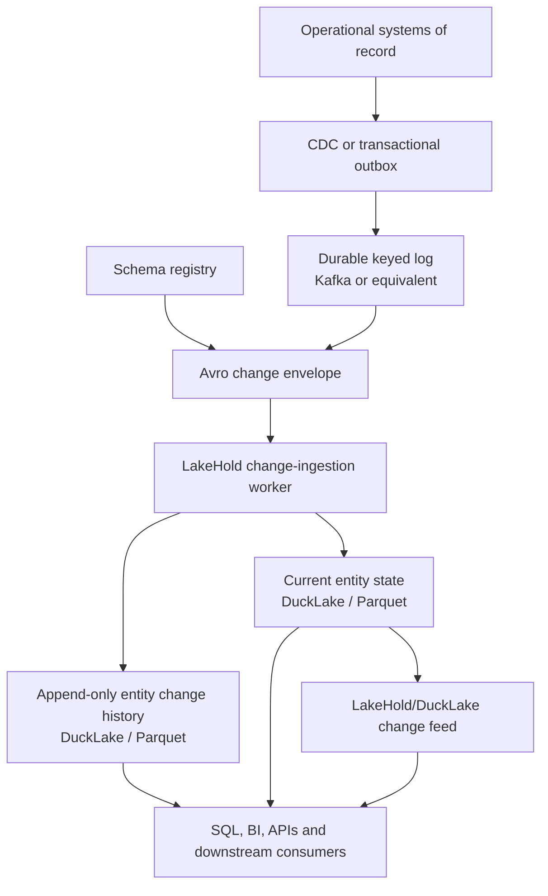

# Avro and an Update-Heavy Enterprise Data Platform

> **Review note — 8 August 2026:** This document records an architecture assessment for future
> review. It is not an approved implementation plan or a claim that LakeHold currently supports
> Avro ingestion, Kafka, a schema registry, or source-log CDC. Repository observations were checked
> at `6de3f183430be47cebe3742e6fcac0a3834c3e89` on `main`. Upstream capabilities can change and must
> be revalidated before implementation.

## Executive decision

LakeHold should consider Avro as a **versioned change-event and ingestion format**, while retaining
DuckLake and Parquet as its governed table and physical storage layers.

The case for Avro becomes stronger when an Enterprise Data Platform (EDP) receives many updates to
entities such as customers, shipments, orders, bookings, products or locations. Avro can provide a
compact, typed contract for successive versions of those entities and can work naturally with Kafka,
Debezium and schema registries.

Avro does not itself implement an entity update. It does not define entity identity, operation type,
ordering, deduplication, delete handling, checkpoints, transaction boundaries, current-state
materialisation or conflict resolution. Those semantics must come from a CDC or outbox envelope, a
durable ordered transport, the ingestion service and the lakehouse table format.

The recommended boundary is therefore:

- **Use Avro for:** keyed change events, schema evolution, compact transport, Kafka/CDC integration
  and bounded Avro object-container file imports.
- **Use DuckLake for:** governed tables, transactions, snapshots, time travel, updates, deletes and
  the table change feed.
- **Use Parquet for:** durable columnar analytical storage and the verified open-format exit path.
- **Do not use Avro as:** a replacement for DuckLake, a second physical DuckLake storage format, or
  proof that update ordering and replay are correct.

This extends the layer model in
[Spark, Parquet and Lakehouse Table Formats](SPARK-PARQUET-LAKEHOUSE-FORMATS.md): Avro and Parquet are
file or serialization formats; DuckLake is the table format; LakeHold is the platform above them.

## The central distinction

The intuition that a row-oriented format should suit frequently changing entities is partly right,
but it is easy to draw the wrong conclusion from it.

An Avro record can efficiently describe a new version of an entity. Appending that record does not
replace the earlier record. Without a key and an operation envelope, the result is only two records,
not one updated entity. Without an ordering or source position, a consumer cannot safely decide
which version is current. Without delete semantics, a missing entity may remain visible forever.

Likewise, Parquet files are not individually mutable tables. DuckLake supplies the metadata,
snapshots, delete files and commit semantics that turn Parquet data into a table that supports SQL
updates and deletes. Comparing raw Avro mutation with raw Parquet mutation therefore misses the
table layer where correctness lives.

| Concern | Avro | Parquet | DuckLake | Durable log or CDC source |
|---|---|---|---|---|
| Compact row/event encoding | Strong fit | Not its design centre | Delegates to its data files | Transport-dependent |
| Analytical column scans | Weak fit relative to Parquet | Strong fit | Coordinates Parquet reads | Not its design centre |
| Schema carried or resolved with a record | Strong fit | File schema is available | Governs table schema | Registry/source-dependent |
| Entity key and operation semantics | Must be added in an envelope | Must be modelled in columns | Can apply keyed DML | Usually supplied by CDC/outbox |
| Ordering and replay position | Not supplied by Avro | Not supplied by Parquet | Snapshot order after publication | Core responsibility |
| Atomic current-state update | Not supplied by Avro | Not supplied by Parquet | Supported through table commits | Must coordinate its checkpoint |
| Deletes and time travel | Not supplied by Avro | Not supplied by raw files | Delete files and snapshots | Delete events/tombstones and retention |

## What Avro contributes to an EDP

### Compact typed change records

Avro is a binary, row-oriented serialization format with primitive types, records, arrays, maps,
unions, enums, fixed values and logical types. A schema registry can hold schema versions so each
Kafka record carries only a small schema identifier rather than embedding a complete schema.

This is attractive for a high-volume update stream because:

- network and broker storage can be smaller than verbose schema-bearing JSON;
- the producer and consumer share an explicit structural contract;
- schema identifiers give lineage and compatibility checks a stable input;
- different entity types can evolve independently; and
- older events can remain readable by newer consumers when evolution rules are followed.

Actual size and throughput improvements are workload-specific and must be benchmarked against the
current NDJSON path rather than assumed.

### Schema evolution

Avro distinguishes the schema used to write a record from the schema a consumer expects. Its
resolution rules support compatible evolution such as:

- ignoring a writer field that the reader no longer contains;
- supplying a reader default for a newly added field;
- recursively resolving compatible records, arrays, maps and unions; and
- promoting selected numeric and string/byte types.

Schema evolution is not automatic data governance. A platform still needs compatibility policy,
review, ownership, schema identity, a breaking-change process and tests against retained historical
events. Renaming, narrowing a type, adding a required field without a default or changing entity
meaning can still break consumers.

### Kafka and CDC ecosystems

Kafka log compaction is useful for keyed mutable data because it retains at least the latest known
value for each message key. A record with a key and null value can act as a deletion tombstone.
Compaction is a transport retention feature, not a substitute for the analytical history table:

- compaction runs asynchronously;
- all recent versions can remain in the uncompacted head;
- consumers must process events idempotently;
- ordering is scoped to a partition;
- tombstones are themselves removed after their retention period; and
- a consumer that falls too far behind can miss a tombstone.

Debezium illustrates the complete pattern more accurately than “Avro updates entities.” It captures
committed database changes, supplies a keyed change envelope with `before`, `after`, operation and
source metadata, serializes that envelope using Avro when configured, and relies on Kafka for the
ordered replayable log.

### Two meanings of “Avro input”

These must remain separate in product and implementation language:

1. **Avro object-container files** contain blocks of records and an embedded writer schema. DuckDB's
   `read_avro` reads this form from local files, HTTP or S3.
2. **Kafka Avro records** commonly carry a registry-specific wire header and schema identifier.
   They require a Kafka consumer, schema-registry client and compatible Avro deserializer. They are
   not ordinary Avro object-container files and cannot be ingested merely by calling `read_avro`.

DuckDB 1.5.5, which LakeHold currently pins, has signed Avro extension artifacts for the relevant
platforms. A disposable smoke test read the official 1,000-row Avro sample successfully. The current
DuckDB reader nevertheless has important limitations for an analytical file plane: no parallel
scan, projection pushdown, filter pushdown, recursive Avro types or `union_by_name`. It is therefore
best suited to bounded import rather than replacing Parquet scans.

## Recommended EDP architecture

Kafka is not required infrastructure for every LakeHold deployment. HTTP, gRPC or another adapter
may supply the same internal change contract. The important design decision is to keep source
capture, serialization, transport and table publication as separate responsibilities.

### Source capture

Use a database's logical change stream or Debezium when authoritative writes happen outside the
application. Use a transactional outbox only when every relevant write path participates in the
same operational transaction. Polling an `updated_at` field can be acceptable for a bounded source,
but it normally cannot prove delete capture, commit ordering or gap-free replay without a much
stronger source contract.

Snapshots remain necessary for bootstrap, repair and resynchronisation. A CDC position and the
snapshot must be fenced so changes committed during bootstrap are not omitted.

### Change envelope

Define a format-neutral envelope before choosing its Avro representation. A proposed minimum is:

| Field | Purpose |
|---|---|
| `eventId` | Stable idempotency identity for one source change |
| `tenant` and `source` | Routing, authorization and lineage |
| `entityType` | Governed entity or aggregate identity |
| `entityKey` | Stable business or source primary key |
| `operation` | `snapshot`, `create`, `update` or `delete` |
| `sourcePosition` | LSN, offset, sequence or another totally ordered source position |
| `sourceVersion` | Optimistic entity version where the source provides one |
| `transactionId` | Correlates changes committed together |
| `transactionSequence` | Preserves order within a source transaction |
| `occurredAt` | Source commit/event time, not ingestion time |
| `schemaId` and `schemaVersion` | Registry identity and explicit contract evidence |
| `before` | Optional prior image for audit or diff requirements |
| `after` | Complete post-image; null for a delete |

The Kafka key should normally include the tenant, entity type and stable entity or aggregate key.
If multiple entity types must be observed atomically, transaction metadata alone does not make
separate Kafka partitions atomic. The design must either route the aggregate to one partition,
materialise a source transaction as one unit, or explicitly accept eventual consistency.

### Prefer complete post-images to patches

The default update event should contain a complete `after` image. Patch-only events make replay and
schema evolution harder because a consumer must distinguish:

- a field that was omitted because it did not change;
- a field that did not exist in the producing schema;
- a field explicitly set to null; and
- a value unavailable from the source change log.

Patches can be supported only with explicit patch semantics, source version checks and a reliable
bootstrap/base state. They should not be inferred from missing Avro fields.

### Materialise both history and current state

An update-heavy EDP normally needs two different products:

1. **Append-only change history** for audit, replay, lineage, temporal analysis and rebuilding a
   projection.
2. **Current entity state** for ordinary joins, BI and serving the latest known version.

The history table should retain the source position, event identity, schema identity, operation,
business key, transaction metadata and decoded values. Where exact original bytes are required for
audit, retain them as a bounded binary payload or in governed object storage with a digest and
reference; do not make opaque bytes the only queryable history.

The current-state table should apply only the newest accepted change for each key. A delete may
physically remove the current row or retain a governed `is_deleted` state depending on downstream
requirements, but the history must preserve the delete event either way.

## Update processing and batching

The EDP should not create one DuckLake commit for every entity event. A worker should process a
bounded micro-batch:

1. Read an ordered source window without advancing the durable checkpoint.
2. Validate the envelope, schema identity, operation and required keys.
3. Deduplicate by `eventId` and reject conflicting reuse of the same identity.
4. Detect gaps, regressions and late events using `sourcePosition` or `sourceVersion`.
5. Append accepted events to the immutable history table.
6. Coalesce repeated updates to the same entity key within the batch.
7. Apply the latest accepted state per key to the current-state table.
8. Commit the DuckLake transaction.
9. Advance the source checkpoint through the same publication fence.

At-least-once delivery is acceptable only when replay has exactly-once effects at the target. The
same event window must replace the same keys and must not duplicate the history record. A consumer
offset committed before the DuckLake transaction creates loss; a target commit followed by a
checkpoint failure must safely replay.

Batch size and linger time are workload decisions. Larger batches improve write and file efficiency
but increase visibility latency and the amount of replay after failure. They must be tuned using the
actual entity width, change rate, object store, query concurrency and freshness objective.

## DuckLake and frequent updates

DuckLake supports the correct table semantics for this architecture:

- SQL updates and deletes commit as snapshots;
- updates appear in its change feed as paired `update_preimage` and `update_postimage` rows;
- deletes use merge-on-read delete files rather than rewriting a complete data file immediately;
- time travel can recover earlier table state; and
- files with heavy delete density can later be rewritten and compacted.

Merge-on-read makes initial changes efficient, but frequent replacements create physical work that
Avro would not remove. Delete files and small files can increase read amplification. DuckLake's
documentation explicitly warns that heavily deleted tables can suffer reduced read performance and
provides `ducklake_rewrite_data_files` to rewrite them.

An update-heavy operating model therefore needs per-table observation of:

- entity changes and distinct keys per batch;
- repeated updates coalesced per key;
- source-to-publication latency and consumer lag;
- duplicate, late, conflicting and rejected events;
- data-file and delete-file counts and sizes;
- delete density and read amplification;
- inlined row volume and flush behaviour;
- compaction and rewrite duration, bytes and failures; and
- query latency before and after maintenance.

If the requirement is sustained row-at-a-time OLTP, sub-second synchronous entity reads and high
concurrent write serving, the operational database should remain the serving authority. LakeHold
should consume its change log and provide governed analytical state rather than being forced into an
OLTP role by a serialization-format decision.

## Fit with the current LakeHold implementation

### Already aligned

LakeHold already contains several destination-side primitives needed by this design:

- Managed incremental connectors carry durable proposed/current checkpoints.
- Checkpoints advance only after DuckLake publication while the PostgreSQL publication fence is
  held.
- Keyed deltas are validated for required and non-null keys and duplicate keys.
- Existing target rows matching the delta are deleted and replacements are inserted in one labelled
  DuckLake transaction.
- Replaying the same delta has idempotent current-state effects.
- Explicit `reject`, `additive` and `mapped-version` schema policies exist.
- Connector run history records an initial source-to-table lineage trail.
- DuckLake's change feed is exposed as typed insert, delete, update-preimage and update-postimage
  records.
- Outbound delivery is at least once, with durable delivery identity and consumer-side
  deduplication information.

See [Managed Data Connectors](CONNECTORS.md),
[Enterprise Data Platform Roadmap](ENTERPRISE-DATA-PLATFORM-ROADMAP.md) and
[Public API](PUBLIC-API.md).

### Material gaps

The current implementation does not yet provide the full inbound change architecture:

- no Kafka connector;
- no Avro or schema-registry-aware event deserializer;
- no generic source-log CDC connector;
- PostgreSQL ingestion is ordered polling, not logical replication;
- current PostgreSQL and HubSpot paths do not capture source deletes;
- connector scratch data is normalised to NDJSON before DuckLake publication;
- the connector target and publication model is centred on one table, so cross-table source
  transaction handling needs an explicit design;
- the keyed current-state upsert does not by itself provide a separately governed immutable event
  history; and
- retained source history, bootstrap fencing and resynchronisation are not proven for a Kafka/CDC
  source.

Adding `.avro` to the browser file importer would be useful but would not close these update
semantics. The higher-value capability is a change-event ingestion contract plus a registry-aware
connector.

## Recommended delivery sequence

### Phase 1 — contract and workload proof

1. Select one representative, update-heavy entity family and obtain real distributions for entity
   width, update frequency, deletes, schema changes, batch arrival and required freshness.
2. Define the format-neutral change envelope, keying, ordering, deletion, transaction and replay
   rules.
3. Define current-state and immutable-history table contracts.
4. Choose and document schema compatibility policy, ownership and breaking-change procedure.
5. Build a benchmark/replay harness before selecting production defaults.

### Phase 2 — Avro object-container file import

This is a bounded interoperability feature, independent of Kafka:

- package and load DuckDB's signed `avro` extension;
- add an Avro tabular import mode that reuses existing authorization, scratch limits, Duckling gate,
  conflict refusal, transaction and error-redaction behaviour;
- import through `CREATE TABLE ... AS SELECT * FROM read_avro(local_scratch_path)`;
- add `read_avro` to the external-planner external-access deny-list;
- test nested types, logical types, unions, supported codecs, corrupt files, recursive schemas,
  schema mismatches, resource ceilings and all packaged platforms; and
- describe the result accurately: Avro is ingested, then DuckLake persists the table as Parquet.

### Phase 3 — registry-aware change connector

- Implement a connector through the existing adapter abstraction rather than a second ingestion
  stack.
- Support explicit broker, topic, consumer group, security and registry configuration through
  deployment-owned secrets.
- Decode Kafka Avro wire records with the selected registry client; do not route them through
  `read_avro`.
- Validate schema compatibility and retain schema identity in run/event lineage.
- Apply bounded replay, pause/resume, dead-letter, ownership, quality and safe-error policies from
  the current connector platform.
- Atomically coordinate target publication and source offset/checkpoint advancement.
- Support explicit create, update and delete operations and an initial snapshot/bootstrap fence.

### Phase 4 — update-heavy operations

- Expose freshness, lag, throughput, late-event, dead-letter and schema-compatibility metrics.
- Add update/delete density and maintenance recommendations to the table operating view.
- Establish automatic or operator-driven file rewrite and compaction policy with dry-run evidence.
- Prove crash recovery, lease takeover, rebalance, broker outage, registry outage, secret rotation,
  schema change, tombstone retention, bootstrap/resync and target drift.
- Decide whether multi-table source transactions are atomic, grouped by aggregate, or intentionally
  eventually consistent.

## Acceptance and benchmark programme

Avro adoption should be approved only after a side-by-side workload test. At minimum compare the
current NDJSON route with registry-backed Avro under the same source events and DuckLake target.

### Workload dimensions

- narrow, medium and wide entities;
- create/update/delete mixes representative of production;
- repeated hot-key updates versus uniformly distributed keys;
- complete post-images versus any proposed patch format;
- schema additions, removals, renames and incompatible type changes;
- one event per message and realistic producer batching;
- cold bootstrap, caught-up steady state and backlog recovery;
- local and supported object storage; and
- concurrent ingestion plus representative analytical queries.

### Measurements

- source events and payload bytes per second;
- broker and registry overhead;
- decode CPU and allocation;
- end-to-end event-to-query visibility latency;
- DuckLake commit duration and rows per commit;
- current-state and history-table correctness;
- duplicate, missing, out-of-order and delete correctness after replay;
- number and size of data/delete files;
- query latency as delete density grows;
- compaction/rewrite I/O and recovery time; and
- bootstrap and resynchronisation duration.

### Failure scenarios

- worker termination before and after DuckLake commit;
- checkpoint/offset write failure;
- duplicate delivery and consumer rebalance;
- late older entity version after a newer version;
- missing source position or entity key;
- registry unavailable or schema identifier unknown;
- compatible and incompatible schema changes;
- delete followed by recreate of the same key;
- tombstone retention elapsed before a lagging consumer catches up;
- partial multi-entity source transaction; and
- compaction or snapshot expiry while a consumer still needs history.

No format should be called the winner without both transport results and table-maintenance results.
Avro may improve event throughput while the overall workload remains limited by DuckLake update
publication, file maintenance or object-store latency.

## Product positioning

If implemented and proven, the accurate claim would be:

> LakeHold can ingest governed Avro change events, preserve their lineage and history, and
> materialise current analytical entity state transactionally into open DuckLake/Parquet tables.

It would not be accurate to claim:

- DuckLake stores its tables in Avro;
- Avro makes LakeHold an operational database;
- Avro alone provides CDC or exactly-once processing;
- an Avro file upload is equivalent to Kafka/Schema Registry support; or
- schema evolution makes every entity-contract change backward compatible.

This capability would strengthen the ingestion side of LakeHold's EDP position. It would not replace
the separate roadmap work for governance, stable asset identity, lineage, semantic models, policy,
enterprise consumption, operations or multi-node evidence.

## Questions for future review

- Which concrete source systems and entities generate the expected update volume?
- Are changes captured from database logs, application outboxes, existing Kafka topics or polling?
- Is Kafka already mandatory customer infrastructure, an optional adapter or outside LakeHold's
  intended operating model?
- Which schema registry and wire compatibility are required: Apicurio, Confluent or both?
- What is the expected peak event rate, entity width, hot-key concentration and delete ratio?
- What freshness objective applies to current-state tables?
- Must every historical change be retained, or is current state plus bounded audit sufficient?
- Do consumers need full pre-images, complete post-images or explicitly versioned patches?
- How are updates spanning several related entity tables made consistent?
- What is the canonical entity key when source primary keys can change?
- What happens to a late event whose source version is older than the current row?
- Which schema-compatibility mode and approval process govern production topics?
- How long must source offsets, schemas, tombstones, DuckLake snapshots and history be retained?
- At what sustained update rate does an operational serving store become necessary alongside
  LakeHold?

## Sources

Primary documentation reviewed on 8 August 2026:

- [Apache Avro 1.12.0 specification](https://avro.apache.org/docs/1.12.0/specification/)
- [Apache Avro schema resolution](https://avro.apache.org/docs/1.12.0/specification/#schema-resolution)
- [Apache Kafka 4.3 log compaction design](https://kafka.apache.org/43/design/design/#log-compaction)
- [Debezium Avro serialization](https://debezium.io/documentation/reference/stable/configuration/avro.html)
- [Debezium PostgreSQL change events](https://debezium.io/documentation/reference/stable/connectors/postgresql.html#postgresql-events)
- [DuckDB Avro extension](https://duckdb.org/docs/current/core_extensions/avro.html)
- [DuckLake specification](https://ducklake.select/docs/stable/specification/introduction.html)
- [DuckLake data change feed](https://ducklake.select/docs/stable/duckdb/advanced_features/data_change_feed.html)
- [DuckLake delete-file specification](https://ducklake.select/docs/stable/specification/tables/ducklake_delete_file.html)
- [DuckLake rewrite of heavily deleted files](https://ducklake.select/docs/stable/duckdb/maintenance/rewrite_data_files.html)

LakeHold-specific findings are based on the current repository implementation and documentation,
particularly [Managed Data Connectors](CONNECTORS.md),
[Enterprise Data Platform Roadmap](ENTERPRISE-DATA-PLATFORM-ROADMAP.md),
[Public API](PUBLIC-API.md), and
[Spark, Parquet and Lakehouse Table Formats](SPARK-PARQUET-LAKEHOUSE-FORMATS.md).
