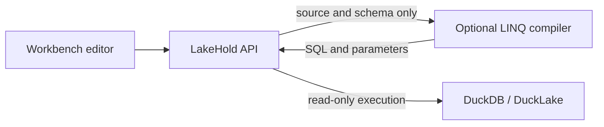

# C# LINQ in the Workbench

LakeHold adds C# LINQ to the Workbench without embedding a compiler in the API. SQL remains the
built-in language. The optional `Lakehold.Linq.Compiler` process receives only query source and a
catalog schema snapshot, uses `DuckDB.EFCoreProvider` to translate the expression, and returns
parameterized DuckDB SQL. The API alone owns catalog credentials and executes the generated plan
through the same authorization, read-only attachment, row-limit, telemetry, and history path as SQL.

**Shipped contract:** LakeHold v1.2.0 or newer with `DuckDB.EFCoreProvider` 1.17.0. No command
interception, parameter-placeholder rewriting, or duplicate store-type map remains in LakeHold.



## Enable or remove it

Development:

```bash
docker compose --profile linq up
```

Production:

```bash
export LAKEHOLD_LINQ_PLANNER_KEY='<a long random secret>'
docker compose -f compose.production.yaml --profile linq up -d
```

Omit the `linq` profile to remove the compiler. The API health-checks configured planners during
language discovery, so an absent or unhealthy compiler removes C# LINQ from the selector without
degrading SQL. More languages can be added through `Lakehold:Querying:Planners`; the API depends
only on the contracts in `Lakehold.Querying`. Planner endpoints are HTTP(S) base URIs and must end
in `/` so the host can append `descriptor`, `starter`, and `plan` without path ambiguity. The
planner also owns catalog-aware starter generation, ensuring the editor and compiler use exactly
the same identifier rules for awkward, numeric, keyword, and colliding catalog names.

The compiler image is non-root, read-only, has no catalog or control-plane volume, runs on an
internal-only Compose network, and is bounded to one CPU, 512 MB of memory, and 128 processes. Each
compilation runs in a disposable child process with a hard deadline. The HTTP surface also caps the
request body, concurrent compilations, queued work, source length, table/column count, and literal
array size. In production it refuses to start without a shared secret, and compares that secret in
constant time. `/health` is liveness-only while `/ready` proves a real provider translation can run.
Treat the process as an untrusted-code boundary even though the source policy accepts only a
side-effect-free LINQ expression.

The compiler limits can be overridden under `Lakehold:LinqCompiler`:

| Setting | Default | Purpose |
|---|---:|---|
| `MaxSourceLength` | 100,000 | Maximum authored characters |
| `MaxTables` | 1,000 | Maximum tables/views in one schema snapshot |
| `MaxColumns` | 20,000 | Maximum total columns in one schema snapshot |
| `MaxArrayElements` | 1,000 | Maximum elements in a literal array initializer |
| `Timeout` | 10 seconds | Hard lifetime of the disposable compiler child process |
| `MaxConcurrentCompilations` | 1 | Concurrent compiler workers per planner container |
| `MaxQueuedCompilations` | 8 | Bounded oldest-first wait queue |

The API does not trust a planner merely because it is configured. Before execution it requires the
current schema fingerprint, bounded SQL and parameter payloads, unique portable named parameters
whose placeholders match exactly, one `SELECT`/`WITH`/`VALUES` statement, and a DuckDB-confirmed
read query. External-access and dynamic-query table functions are refused. Compilation latency and
plan-cache hits/misses are emitted through LakeHold telemetry; source and generated SQL are never
metric tags.

## HTTP contract

The Workbench discovers languages rather than assuming LINQ is installed:

```http
GET /api/query-languages
```

SQL is always returned. A healthy compiler adds a `csharp-linq` descriptor. The catalog-aware
starter comes from:

```http
GET /api/tenants/{tenant}/catalogs/{catalog}/query-languages/csharp-linq/starter
```

Execute authored source with the existing query endpoint:

```http
POST /api/tenants/{tenant}/catalogs/{catalog}/query
Content-Type: application/json

{
  "language": "csharp-linq",
  "source": "Main.Events.Where(e => e.Revenue > 100).OrderBy(e => e.Country)"
}
```

The response retains the ordinary columns, rows, truncation, elapsed time, and affected-row fields,
and adds `language`, `generatedSql`, and source `diagnostics`. SQL callers can keep sending the
backward-compatible `{ "sql": "..." }` request; its `generatedSql` is null.

## Query shape

The editor exposes schemas as Pascal-cased variables and tables/views as Pascal-cased properties.
Underscores become word boundaries. For example, `main.events` with `event_type`, `country`, and
`revenue` is queried as:

```csharp
from e in Main.Events
where e.EventType == "purchase"
group e by e.Country into purchases
orderby purchases.Sum(e => e.Revenue) descending
select new
{
    Country = purchases.Key,
    Count = purchases.Count(),
    Revenue = purchases.Sum(e => e.Revenue)
}
```

The CodeMirror editor provides SQL/C# syntax highlighting, line-level diagnostics, catalog/table/
column completion, LINQ operator completion, indentation, search, and Cmd/Ctrl+Enter execution. The
expression can return `IQueryable<T>` or a translated terminal scalar such as `Count`,
`LongCount`, `Any`, `Sum`, `Average`, `Min`, or `Max`. Arbitrary statements, object construction,
reflection, process, file, environment, networking, and other method calls outside the allow-list
are rejected with line/column diagnostics. Explicit runtime-sized arrays and stack allocation are
rejected; literal array initializers are capped at 1,000 elements by default. LINQ is always
executed read-only, including for owner credentials.

Saved queries preserve their language and authored source. Execution recompiles against the current
catalog schema and records the language/source in query history. Publishing a LINQ definition as a
view stores the schema fingerprint used for translation. The saved-query panel distinguishes a
changed definition from catalog schema drift and asks the author to review and republish. A
definition that produces bound
parameters cannot be published because DuckDB view DDL has no parameter-binding lifetime; use
provider-translated literals in the saved expression. If an optional planner is unplugged, its
saved source remains visible and can be copied, but execution, saved-definition editing, saving,
and publication are disabled until that planner is available again. It is never relabelled or
resaved as SQL.

Provider plans are cached for ten minutes by language, source hash, and the current catalog schema
fingerprint. The schema is still obtained from shared control-plane state for every request, so the
cache is only a node-local performance optimisation: schema changes miss immediately on every node
and cannot execute an old plan.

## Current type boundary

The dynamic model uses the provider's public store-type inspection API and supports its mapped
scalar types, decimals, dates/times, JSON, blobs, and one-dimensional ARRAY columns. Native
`STRUCT`, `MAP`, `UNION`, `ENUM`, `HUGEINT`,
`UHUGEINT`, `VARINT`, `BIT`, and `INTERVAL` columns are omitted from generated LINQ row types because
the provider does not expose EF entity-property mappings for them. Supported columns and tables in
the same catalog remain queryable. Referencing an omitted property produces an editor diagnostic;
a catalog with no supported columns produces `LINQ004`. Raw DuckDB.NET materialization is broader
than the EF model surface used for translation.

The compiler uses the provider's non-executing command-plan APIs for queryables and every supported
terminal operation, and the execution path replays their exact named commands. Provider 1.17.0
removes the final command-interception workaround. Aggregate plans represent database commands, so
empty-sequence results follow DuckDB's database-value semantics rather than EF's client-side result
shaper. Remaining model-mapping opportunities are tracked in
[DuckDB.EFCoreProvider follow-ups](LINQ_PROVIDER_GAPS.md).

## Troubleshooting

| Symptom | Check |
|---|---|
| C# LINQ is absent from the selector | Confirm the `linq` Compose profile is enabled, the API and compiler use the same `LAKEHOLD_LINQ_PLANNER_KEY`, and the compiler's `/ready` endpoint succeeds from the internal network. |
| `503` while planning | The configured planner is unavailable or exceeded its timeout. SQL remains usable; inspect compiler health and bounded-queue saturation. |
| `LINQ001`–`LINQ003` | The expression crosses the read-only source allow-list. Remove side effects, arbitrary method calls, or disallowed static members. |
| `LINQ004` | The catalog cannot produce a usable dynamic EF model, commonly because it has no supported columns. Use SQL for omitted native types. |
| `LINQ005` | Enter exactly one C# expression, without statements or declarations. |
| `LINQ006` | The expression did not compile against the generated catalog model; use the reported line/column and editor completions. |
| `LINQ007` | The expression ends in an unsupported terminal operator. Return an `IQueryable` or use `Count`, `LongCount`, `Any`, `Min`, `Max`, `Sum`, or `Average`. |
| Publish is disabled | Parameterized definitions cannot become DuckDB views; use a provider-translated literal or keep the query saved but unpublished. |

Provider mechanics and their application-independent contract are documented in the
[provider query command-plan guide](https://github.com/skuirrels/DuckDB.EFCoreProvider/blob/main/docs/QUERY-COMMAND-PLANS.md).
