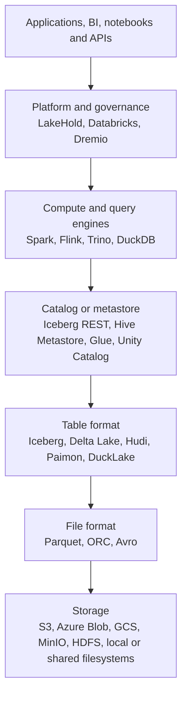

# Spark, Parquet and Lakehouse Table Formats

## Technical summary

Apache Spark, Apache Parquet, Apache Iceberg and Delta Lake are mostly complementary,
not interchangeable:

- **Spark is a compute engine.** It executes distributed SQL, batch, streaming, machine-learning
  and graph workloads.
- **Parquet is a physical file format.** It stores columnar data efficiently, but it does not make
  a collection of files into a transactional table.
- **Iceberg, Delta Lake, Hudi, Paimon and DuckLake are table formats or table platforms.** They add
  metadata, snapshots and commit rules over data files.
- **A catalog gives tables names and makes their metadata discoverable.** It may also provide
  authentication, authorization and credential vending.
- **A lakehouse product bundles several layers.** Databricks, Dremio and LakeHold are platforms,
  not individual file or table formats.

The most consequential architectural choice is normally the **table format and catalog**, not
Parquet. Parquet is the common physical substrate underneath many lakehouse tables.

As a starting point:

- Choose **Iceberg** when broad, neutral multi-engine interoperability leads the decision.
- Choose **Delta Lake** when Spark or Databricks is central.
- Choose **Hudi** when indexed upserts, CDC and incremental processing dominate.
- Choose **Paimon** for Flink-first streaming tables with frequent primary-key updates.
- Choose **DuckLake** when transactional SQL catalog metadata and open Parquet storage are the
  desired foundation, provided its client ecosystem satisfies the required enterprise engines.

These are workload fits, not universal winners. Exact read and write support must be tested with the
specific engine, connector and protocol versions that will run in production.

## The layers of a lakehouse

The names make more sense when placed in their architectural layers:



This is a responsibility model, not a rule that every request literally passes through every box.
For example, a compute engine may resolve table metadata through a catalog and then read Parquet
files directly from object storage.

| Layer | Owns | Does not normally own | Examples |
|---|---|---|---|
| Storage | Durable objects or files | Table schemas, SQL planning or transactions | S3, Azure Blob, GCS, MinIO, HDFS |
| File format | Physical layout, types, encoding and compression | Atomic changes across multiple files | Parquet, ORC, Avro |
| Table format | File membership, snapshots, schema and commit protocol | Query execution or a complete governance platform | Iceberg, Delta Lake, Hudi, Paimon, DuckLake |
| Catalog or metastore | Names, namespaces and table-metadata discovery; sometimes policy and credentials | Usually query execution | Iceberg REST, Hive Metastore, Glue, Unity Catalog |
| Compute engine | Planning, execution, memory and parallelism | Durable cross-engine table state | Spark, Flink, Trino, DuckDB |
| Platform | Operations, UX, governance and integrations across several layers | No universal boundary; the platform is a bundle | LakeHold, Databricks, Dremio |

## What each technology does

| Technology | Layer or kind | What it solves | Best when | Important boundary |
|---|---|---|---|---|
| Apache Spark | Distributed compute engine | Batch processing, Spark SQL, Structured Streaming, MLlib and GraphX | Large distributed transformations or Spark-native pipelines | Spark does not define the durable file or table format |
| Apache Parquet | Columnar file format | Efficient analytical storage, compression, projection and predicate pruning | Data is scanned by columns and must remain broadly portable | Parquet alone has no catalog, atomic multi-file commit, time travel or row-level table semantics |
| Apache Iceberg | Open table format | Atomic snapshots, schema evolution, hidden partitioning, partition evolution and engine-neutral table metadata | Several engines must share large analytical tables | It still needs a catalog, compute engines and a maintenance strategy |
| Delta Lake | Open table format | ACID tables, time travel, schema enforcement and `MERGE`/`UPDATE`/`DELETE` workflows | Spark or Databricks is central, particularly for batch and streaming pipelines | Connector support can lag newer protocol features |
| Apache Hudi | Table format and data-lake services | Indexed upserts/deletes, incremental reads, CDC-oriented processing and table maintenance | Frequently changing records must be ingested and consumed incrementally | Indexing, compaction, clustering, cleaning and table services add operational choices |
| Apache Paimon | Streaming-oriented lake format | Primary-key tables, high-rate updates, changelogs and batch/stream access | Flink-first real-time pipelines need mutable tables | Bucket, merge-engine and compaction choices matter; the wider ecosystem is smaller |
| DuckLake | SQL-catalog table format | Transactional lakehouse metadata stored in a normal SQL database, with Parquet data | PostgreSQL-backed catalog coordination and open storage are architectural priorities | Its cross-engine ecosystem is younger and smaller than Iceberg's or Delta's; enterprise adoption requires validation with every required engine |
| Apache Flink | Distributed stream-processing engine | Stateful computation over bounded and unbounded streams | Continuous low-latency event processing | It is not a file format, table format or catalog |
| Trino | Distributed SQL query engine | Interactive and federated SQL over object stores and other sources | Analysts need one SQL layer across multiple systems | Storage and transaction behaviour depend on the connector and table format |
| DuckDB | Embedded analytical database and engine | Fast in-process OLAP and direct file queries | Local, embedded and application-native analytics | One query executes on one machine; DuckDB is not a distributed query cluster |

## Compute engines and similar or competing technologies

Spark belongs to the **compute layer**, not the file-format or table-format layer. Its closest
alternatives depend on the workload: Flink competes most directly for distributed stream
processing, Trino for distributed interactive SQL, and DuckDB for analytical execution within a
single worker. These engines can also be complementary—for example, Spark may build an Iceberg
table that Trino serves to analysts.

| Technology | Execution model | Primary strength | Relationship to lakehouse formats |
|---|---|---|---|
| Apache Spark | Distributed cluster compute | Large-scale batch transformation, SQL, streaming, ML and graph processing | Reads and writes formats such as Iceberg, Delta Lake and Hudi through connectors |
| Apache Flink | Distributed stateful stream processing | Continuous event processing, low-latency state and streaming pipelines | Reads and writes table formats such as Iceberg, Hudi and Paimon through connectors |
| Trino | Distributed, read-oriented SQL engine | Interactive and federated SQL across object storage and operational systems | Queries Iceberg, Delta Lake, Hudi and other sources through catalog connectors |
| DuckDB | In-process, scale-up analytical engine | Fast analytical execution inside an application or server worker | Reads Parquet directly and supports lakehouse formats through extensions |

The choice of compute engine does not by itself determine where data is stored or how table
transactions work. An enterprise platform may operate more than one engine over the same governed
catalog and storage layer.

### Apache Spark

[Apache Spark](https://spark.apache.org/docs/latest/) is a distributed data-processing framework.
Spark SQL uses structured information about a query and its data to optimize execution, while the
same engine can also support streaming, machine-learning and graph workloads.

Spark answers questions such as:

- How should this transformation be divided across workers?
- How are joins, filters and aggregations planned?
- How should failed tasks be retried?
- How does a bounded batch or continuous stream get processed?

Spark does **not** answer which files constitute version 42 of a table. That responsibility belongs
to a table format such as Iceberg or Delta Lake.

Common combinations include:

```text
Spark + Iceberg + Parquet + Iceberg REST catalog
Spark + Delta Lake + Parquet + Unity Catalog or a metastore
Spark + Hudi + Parquet + a supported metastore
```

### Apache Flink

[Apache Flink](https://flink.apache.org/what-is-flink/flink-architecture/) is a distributed engine
for stateful computation over bounded and unbounded streams. It is the most direct Spark competitor
when continuous event processing, event-time semantics and durable streaming state drive the
architecture. Flink does not replace Parquet or a lakehouse table format; it uses connectors to read
and write them.

Flink is commonly paired with Paimon for frequently updated primary-key tables, and with Iceberg or
Hudi when their interoperability or mutation models better fit the wider platform.

### Trino

[Trino](https://trino.io/docs/current/object-storage.html) is a distributed SQL engine that reads
object-storage tables through format-specific connectors, including Iceberg, Delta Lake and Hudi.
It competes with Spark SQL for some interactive analytical workloads but is more commonly positioned
as a federated query and serving layer than as a general data-processing framework.

An enterprise architecture may use Spark or Flink for ingestion and transformation while Trino
serves governed SQL over the resulting tables.

### DuckDB

[DuckDB](https://duckdb.org/why_duckdb) is an analytical execution engine that can be embedded in
applications and server workers. It can query Parquet and supported lakehouse formats directly and
can use substantial server resources. DuckDB is nevertheless a scale-up engine: an individual query
executes within one process or machine, even when several independent workers share external table
storage.

DuckDB is LakeHold's current execution-worker implementation. It should be treated as one component
behind LakeHold's PostgreSQL control/catalog plane and Parquet data plane—not as the platform's
identity or permanent compute boundary.

## Parquet

[Apache Parquet](https://parquet.apache.org/) is an open, column-oriented data file format. A
Parquet file is divided into row groups, column chunks and pages. Engines can read only the required
columns and use statistics or other indexes to skip data that cannot match a filter.

Parquet is good at:

- Compact analytical storage.
- Column projection.
- Predicate and row-group pruning when the writer and reader support the relevant metadata.
- Nested structures.
- Interoperability across languages and analytical tools.

A directory containing Parquet files is not automatically a reliable database table. Without a
table layer, it normally lacks:

- An atomic commit spanning several files.
- A stable snapshot for readers while writers are changing the directory.
- Safe schema and partition evolution.
- Row-level update and delete semantics.
- Time travel and rollback.
- A record of which files are live, superseded or orphaned.

This is why Iceberg, Delta Lake, Hudi, Paimon and DuckLake can all use Parquet while adding very
different table behaviour above it.

## The table formats compared

### Apache Iceberg

[Apache Iceberg](https://iceberg.apache.org/docs/latest/) is an open table format designed for huge
analytical tables and multiple compute engines. It tracks table snapshots through metadata rather
than treating an object-store directory listing as the table.

Its design strengths include:

- Atomic table snapshots and optimistic concurrent commits.
- Schema evolution based on stable field identifiers.
- Hidden partitioning, so query authors do not need to repeat physical partition predicates.
- Partition evolution without tying existing queries to the old layout.
- Time travel, rollback, branches and tags.
- Broad integrations with engines including Spark, Flink and Trino.
- A standard [Iceberg REST Catalog](https://iceberg.apache.org/rest-catalog-spec/) protocol.

Iceberg is a strong default when the organization wants the table to outlive any one compute engine.
The cost of that neutrality is that catalog selection, file optimization, snapshot expiry, orphan
cleanup and connector compatibility remain explicit architectural responsibilities.

### Delta Lake

[Delta Lake](https://docs.delta.io/) stores Parquet data alongside a transaction log and
checkpoints. It grew from the Spark ecosystem and provides a particularly cohesive experience for
Spark batch and streaming workloads.

Its design strengths include:

- ACID table transactions.
- Time travel and reproducible snapshots.
- Schema enforcement and controlled schema evolution.
- First-class `MERGE`, `UPDATE` and `DELETE` workflows.
- A table that can participate in both batch and streaming processing.
- Connector development through [Delta Kernel](https://docs.delta.io/delta-kernel/).
- Optional [UniForm](https://docs.delta.io/delta-uniform/) metadata generation for some Iceberg and
  Hudi readers.

Delta Lake is the natural starting point for a Spark- or Databricks-centred estate. “Supported by
another engine” must still be checked at the protocol-feature level: a connector may read a basic
Delta table but not every newer table feature or write operation.

### Apache Hudi

[Apache Hudi](https://hudi.apache.org/learn/tech-specs/) combines a table format with services for
mutable, incremental data lakes. It emphasizes record-level changes and near-real-time ingestion.

Hudi offers two important storage models:

- **Copy-on-Write:** updates produce new base files, favouring read performance.
- **Merge-on-Read:** recent changes can remain in log files and be merged at read or compaction
  time, trading some read complexity for faster writes.

Hudi is attractive when stable record keys, CDC, frequent upserts, incremental queries and
change-stream consumption are central. Its additional indexing and storage-management features are
valuable, but they also create more operating decisions than a minimal snapshot-oriented format.

### Apache Paimon

[Apache Paimon](https://paimon.apache.org/docs/1.0/) is a lake format aimed at real-time lakehouse
workloads with Flink and Spark. It combines lakehouse snapshots with LSM-style storage and
primary-key tables.

Its design strengths include:

- Frequent primary-key updates.
- Configurable merge engines.
- Changelog production and streaming reads.
- Append-only and primary-key table models.
- ACID transactions, schema evolution and time travel.
- Parquet as the default file format, with additional formats available.

Paimon is most compelling when Flink owns the ingestion and transformation path and the lake must
behave like a continuously updated table. It is less compelling when the leading requirement is the
broadest possible neutral engine ecosystem.

### DuckLake

[DuckLake](https://ducklake.select/docs/stable/) stores table data in Parquet and table metadata in
ordinary SQL tables. The catalog database supplies the transactional coordination instead of a tree
of metadata files in object storage.

Its design strengths include:

- A catalog that can be inspected, backed up and operated with standard SQL database tooling.
- Transactions, snapshots, time travel and schema evolution.
- Concurrent clients coordinating through transactional catalog metadata and shared storage.
- A catalog model that maps naturally to highly available PostgreSQL and enterprise database
  operations.

DuckLake should be evaluated as **SQL catalog metadata plus open Parquet storage**, not as a synonym
for DuckDB. DuckDB supplies the reference implementation and is LakeHold's current execution engine,
but the table format's strategic value is the separation of transactional metadata from open data.

For an enterprise platform, that value is only sufficient if the required compute engines, BI tools
and operational workflows can use the format at the necessary maturity. DuckLake's DataFusion,
Spark, Trino and PostgreSQL clients are at varying levels of maturity, so production acceptance must
be based on tested read, write, transaction and recovery behaviour rather than the existence of a
connector. Where the ecosystem does not yet satisfy those requirements, LakeHold must provide an
interoperability layer or support an enterprise-standard table/catalog interface such as Iceberg.

## Table-format decision matrix

| Format | Design centre | Update model | Streaming or incremental emphasis | Catalog model | Best fit | Main operational work |
|---|---|---|---|---|---|---|
| Iceberg | Engine-neutral analytical tables | Snapshot commits and engine-supported row-level changes/delete files | Available through integrations, but not the sole design centre | Requires a catalog; REST is standardized | Multi-engine lakehouses | Compaction, snapshot expiry, orphan cleanup and metadata management |
| Delta Lake | Reliable lakehouse tables with strong Spark lineage | First-class `MERGE`, `UPDATE` and `DELETE` | Strong batch/stream integration | Path, metastore or catalog-managed patterns | Spark/Databricks-centred estates | Checkpoints, file optimization, vacuum and protocol compatibility |
| Hudi | Mutable and incremental data lakes | Indexed upserts/deletes using Copy-on-Write or Merge-on-Read | Incremental queries and change streams are central | Common metastore and catalog integrations | CDC-heavy ingestion | Indexing, compaction, clustering, cleaning and timeline services |
| Paimon | Flink-first real-time lakehouse | LSM-style primary-key updates and configurable merge engines | Changelog production and streaming reads/writes are central | Paimon catalog options and ecosystem integrations | High-rate Flink streaming updates | Bucketing, merge engines, compaction and changelog configuration |
| DuckLake | Transactional lakehouse metadata in ordinary SQL | SQL DML coordinated by the catalog database | Not primarily a sub-second streaming format | The catalog is a SQL database by design | PostgreSQL-governed Parquet platforms whose required engine integrations have been validated | Run the catalog as an HA service; operate storage, compaction, expiry, recovery and connector compatibility |

## Other adjacent standards and components

### ORC and Avro

- **ORC** is another columnar analytical file format. It remains important in Hive-oriented and
  related ecosystems.
- **Avro** is row-oriented and often used for event serialization, logs and full-record exchange.
  It is normally a different workload choice from Parquet rather than a table-transaction layer.

### Apache Arrow

Apache Arrow is primarily an in-memory columnar representation and interchange standard. It helps
engines and libraries exchange data efficiently, but it is not a durable lakehouse table format.

### Catalogs and metastores

A table format and a catalog are related but separate:

- A **table format** defines snapshots, files, schemas and commit rules.
- A **catalog** maps names such as `sales.orders` to table metadata and may coordinate commits,
  vend storage credentials or enforce access policy.

Examples include the Iceberg REST protocol and implementations around it, Hive Metastore, AWS Glue
and Unity Catalog. Catalog choice can determine whether multiple engines can find the same table,
how identities reach object storage and where the source of truth for a commit lives.

## Coherent example stacks

| Need | Compute | Table format | Catalog | Files | Why it fits |
|---|---|---|---|---|---|
| Distributed batch ETL plus several query engines | Spark for writes; Trino for interactive reads | Iceberg | Iceberg REST catalog | Parquet | Separates engines and maximizes neutral interoperability |
| Databricks/Spark lakehouse | Spark or Databricks Runtime | Delta Lake | Unity Catalog or a supported metastore | Parquet | Deep integration for `MERGE`, streaming and platform operations |
| High-rate CDC and incremental pipelines | Spark or Flink | Hudi | Supported metastore or catalog | Parquet plus Hudi log structures | Indexes, incremental reads and mutable table services are core features |
| Flink-first real-time primary-key tables | Flink | Paimon | Paimon-supported catalog | Parquet by default | Streaming updates and changelogs drive the design |
| Governed enterprise analytics on operator-controlled infrastructure | Pluggable compute; DuckDB workers in the current LakeHold implementation | DuckLake, with an enterprise interoperability path where required | Highly available PostgreSQL | Parquet on durable object storage | Separates the durable PostgreSQL and Parquet foundation from replaceable execution workers |
| Static analytical exchange or immutable extracts | Any Parquet-capable engine | None, intentionally | Optional | Parquet | A table protocol may be unnecessary without concurrent mutations or history requirements |

## LakeHold must be positioned as an enterprise PostgreSQL and Parquet platform

LakeHold is intended to be an **enterprise-grade professional data platform**, not a local analytics
tool, embedded database wrapper or smaller alternative to a DuckDB service. Its durable architecture
should be presented from the outside in:

```text
Enterprise applications, BI tools and data engineering clients
                            ↓
       LakeHold governance, workload and access plane
                            ↓
   PostgreSQL control plane and transactional catalog metadata
                            +
          Open Parquet data on durable object storage
                            ↓
      Pluggable, horizontally managed execution workers
        (DuckDB is the current worker implementation)
```

The core product commitments are:

- **PostgreSQL for durable platform state and coordination.** Tenant and catalog definitions,
  identity, policy, audit, scheduling, leases and table metadata belong in a highly available,
  recoverable database tier.
- **Parquet for durable analytical data.** Customers retain open files in their own object storage,
  independent of LakeHold's process lifecycle or choice of execution engine.
- **LakeHold for enterprise control.** The platform owns governance, workload management,
  observability, lifecycle automation, secure access, catalog services and operational workflows.
- **Compute as a replaceable subsystem.** LakeHold currently runs in-process DuckDB workers, but the
  platform contract must not make one embedded engine its identity or architectural ceiling.
- **Standards-based access and interoperability.** PostgreSQL wire, JDBC/ODBC, HTTP and .NET APIs,
  plus multi-engine table/catalog integration, are product requirements rather than optional exit
  features.

The current implementation already separates durable state from compute: PostgreSQL holds the
control plane and production DuckLake metadata, Parquet holds analytical data, and in-memory DuckDB
sessions execute queries. That is a useful implementation stage, but it is not the enterprise
positioning. Product-facing language should lead with PostgreSQL, Parquet, governance and
professional operations; DuckDB and DuckLake belong in the detailed implementation description.

### Enterprise architecture implications

An enterprise promise requires explicit acceptance gates beyond storing metadata in PostgreSQL and
data in Parquet:

- Highly available, horizontally scalable API and worker deployment.
- Workload queues, admission control, quotas, cancellation and noisy-neighbour isolation.
- A defined strategy for queries that exceed one worker's CPU, memory or execution-time envelope.
- SSO, lifecycle-managed identities, RBAC and fine-grained data policy.
- Immutable audit evidence, lineage and policy-decision records.
- Encryption, managed secrets, credential vending and tenant-scoped storage access.
- Tested backup, point-in-time recovery, disaster recovery and zero/controlled-downtime upgrades.
- Published SLOs, health models, capacity metrics, traces and actionable operator diagnostics.
- Production-grade PostgreSQL wire, JDBC/ODBC and BI compatibility.
- Validated read and write interoperability for every supported table format and compute engine.

DuckDB can remain a useful execution worker for workloads that fit a single node. It must not define
the platform ceiling. LakeHold needs a pluggable execution boundary and a documented path for larger
or distributed workloads, whether through additional engines, delegation or an enterprise catalog
interface.

### DuckLake is an implementation decision, not the market category

LakeHold should retain DuckLake only for as long as its PostgreSQL-catalog and Parquet model advances
the enterprise architecture. If enterprise customers require Spark, Trino or other engines to read
and write the same live tables, LakeHold must supply tested compatibility rather than treating eject
or export as an adequate substitute. An Iceberg REST-compatible interface, native Iceberg support or
another standards-based bridge is therefore a strategic platform capability.

The table format should be selected by transaction correctness, recovery, governance and engine
interoperability requirements. LakeHold's market category is the enterprise data platform above
those formats—not “a DuckDB warehouse” and not “the simplest lakehouse for a small team.”

## Limits that can change the decision

- **Feature support is connector-specific.** “Engine X supports format Y” does not guarantee every
  protocol feature or write operation.
- **Open files do not guarantee painless exit.** Delete files, deletion vectors, transaction logs,
  catalog-managed commits, custom types and maintenance state can affect portability.
- **Streaming means different things.** Spark Structured Streaming, Flink stateful streaming,
  Delta streaming tables, Hudi incremental queries and Paimon changelogs solve related but distinct
  problems.
- **Catalog and governance are separate decisions.** A format may be open while identity, policy,
  lineage and credential vending remain platform-specific.
- **Maintenance is part of correctness and performance.** Small-file control, compaction,
  vacuum/expiry, orphan cleanup and metadata scaling must be tested under the intended write pattern.
- **There is no useful universal performance winner.** Results depend on engine versions, data
  layout, file sizes, object-store latency, concurrency, cache state and maintenance history.
- **Enterprise grade is an acceptance standard, not a label.** High availability, security,
  governance, interoperability, workload management, recovery and operator evidence must be proven
  independently of the chosen table or compute engine.

## Recommended decision sequence

1. Define the enterprise workloads: batch ingestion, interactive SQL, CDC/upserts, low-latency
   streaming, BI, ML and governed data sharing.
2. List every engine that must read and every engine that must write.
3. Choose the table format around that interoperability boundary and mutation pattern.
4. Choose the catalog and identity model; test concurrent commits and credential flows.
5. Standardize the physical files—usually Parquet—plus target file sizes, partitioning or clustering
   and maintenance.
6. Run a controlled proof covering schema evolution, `MERGE` or delete, time travel, failure
   recovery and at least two concurrent writers.
7. Prove the enterprise operating model: HA, workload isolation, security, audit, backup, disaster
   recovery, upgrades, observability and capacity management.
8. Document the exit and interoperability paths: how another engine discovers and safely reads or
   writes the table, and what happens if the primary platform is unavailable.

## Questions to settle before choosing

- Must non-primary engines write, or is read-only interoperability enough?
- Is sub-minute change visibility required, or are minute/hour batches acceptable?
- Are updates keyed by stable business keys, or is the workload mainly append-only?
- Who owns compaction, snapshot expiry, catalog backup and schema governance?
- Which engines must participate in the enterprise compute fabric, and which are read-only versus
  authoritative writers?
- What query sizes and concurrency levels must exceed the current single-worker execution model?
- Which availability, recovery, security and governance SLOs define “enterprise grade” for
  LakeHold's target customers?
- Must Iceberg interoperability support live transactional reads and writes, or will LakeHold adopt
  Iceberg as a native table/catalog option alongside DuckLake?

## Sources

Primary project documentation reviewed on 2 August 2026:

- [Apache Spark documentation](https://spark.apache.org/docs/latest/)
- [Apache Parquet documentation](https://parquet.apache.org/docs/)
- [Apache Iceberg documentation](https://iceberg.apache.org/docs/latest/)
- [Apache Iceberg REST Catalog specification](https://iceberg.apache.org/rest-catalog-spec/)
- [Delta Lake documentation](https://docs.delta.io/)
- [Delta Kernel documentation](https://docs.delta.io/delta-kernel/)
- [Delta UniForm documentation](https://docs.delta.io/delta-uniform/)
- [Apache Hudi technical specification](https://hudi.apache.org/learn/tech-specs/)
- [Apache Paimon documentation](https://paimon.apache.org/docs/1.0/)
- [DuckLake documentation](https://ducklake.select/docs/stable/)
- [Apache Flink architecture](https://flink.apache.org/what-is-flink/flink-architecture/)
- [Trino object-storage documentation](https://trino.io/docs/current/object-storage.html)
- [DuckDB design overview](https://duckdb.org/why_duckdb)

LakeHold-specific observations are based on the current repository architecture and
[`README.md`](../README.md).
